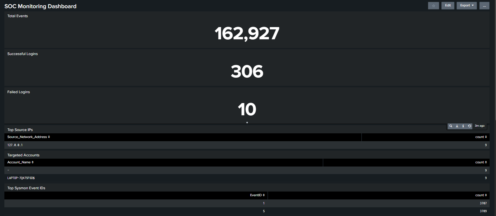
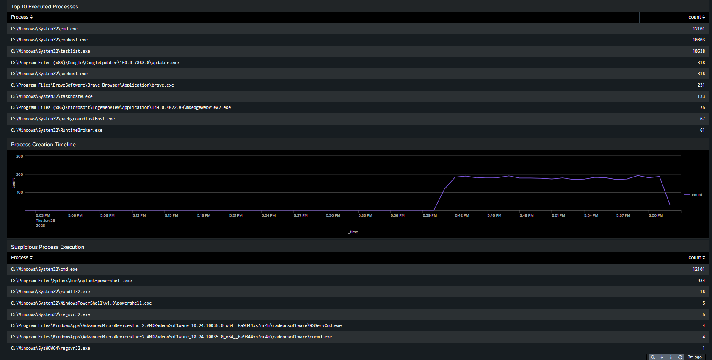
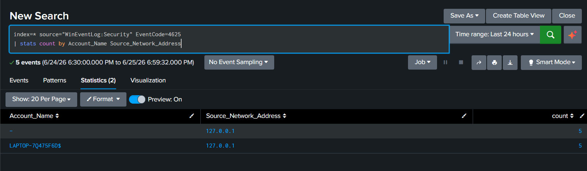
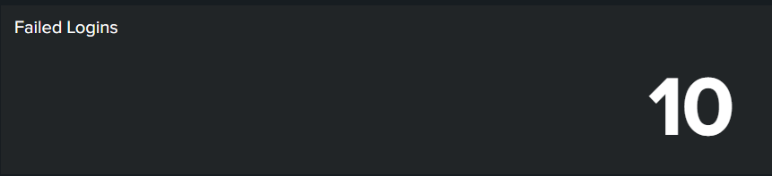
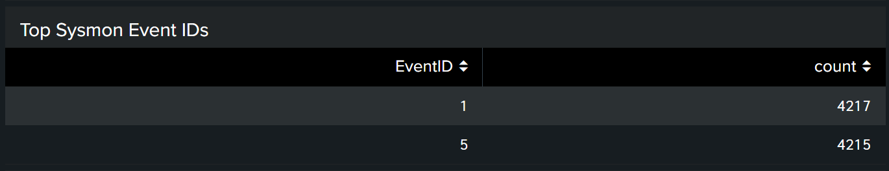
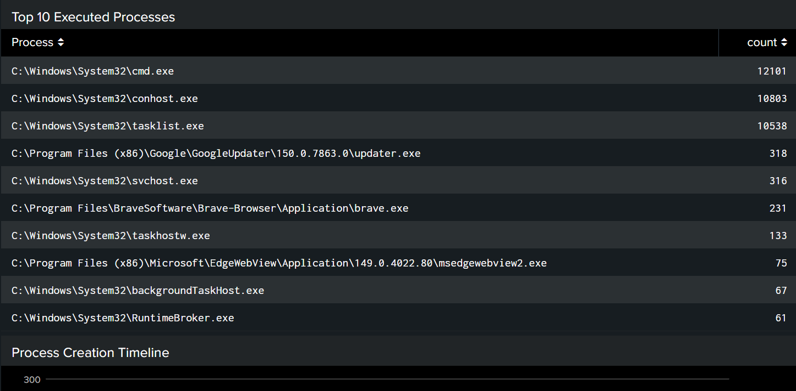
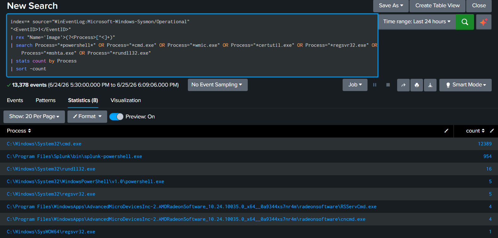
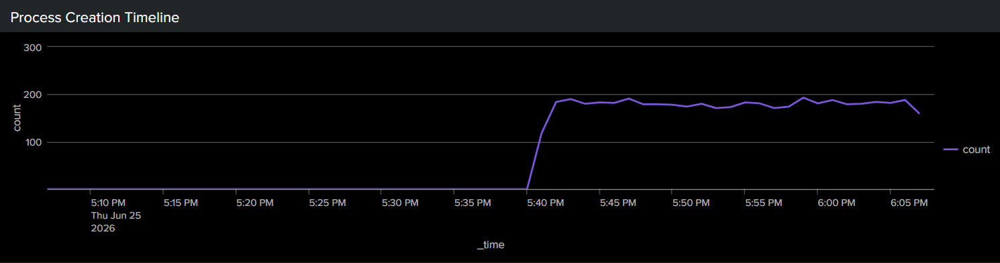

# SOC Monitoring & Threat Detection Lab using Splunk and Sysmon

A Security Operations Center (SOC) monitoring lab built using **Splunk Enterprise** and **Sysmon** to collect, analyze, and visualize Windows security events. This project demonstrates log ingestion, threat detection, alerting, and dashboard creation using Splunk Search Processing Language (SPL).

---

## Project Overview

This project simulates a SOC environment where Windows event logs are continuously monitored for suspicious activity. Sysmon enhances endpoint visibility by recording detailed process creation events, while Splunk is used to ingest logs, detect threats, generate alerts, and visualize security data through dashboards.

---

## Objectives

- Install and configure Splunk Enterprise
- Install and configure Sysmon
- Ingest Windows Security and Sysmon logs
- Detect suspicious activities using SPL queries
- Create security alerts
- Build a SOC monitoring dashboard
- Document findings through an incident report

---

## Tech Stack

- Splunk Enterprise
- Sysmon (Microsoft Sysinternals)
- Windows Event Viewer
- SPL (Search Processing Language)
- Windows Security Logs

---

## Features

- Windows Security Log Monitoring
- Sysmon Process Creation Monitoring
- Failed Login Detection (Event ID 4625)
- Successful Login Detection (Event ID 4624)
- Brute Force Login Detection
- Suspicious Process Detection
- Top Executed Processes
- Top Sysmon Event IDs
- Process Creation Timeline
- Interactive SOC Dashboard
- Automated Splunk Alert

---

## Event IDs Used

| Event ID | Description |
|----------|-------------|
| 4624 | Successful Login |
| 4625 | Failed Login |
| 1 | Sysmon Process Creation |
| 5 | Sysmon Process Termination |

---

## Detection Queries

### Failed Login Detection

```spl
index=* source="WinEventLog:Security" EventCode=4625
| stats count by Account_Name Source_Network_Address
| sort -count
```

### Successful Login Detection

```spl
index=* source="WinEventLog:Security" EventCode=4624
| stats count by Account_Name
| sort -count
```

### Brute Force Detection

```spl
index=* source="WinEventLog:Security" EventCode=4625
| stats count by Account_Name Source_Network_Address
| where count >= 5
| sort -count
```

### Suspicious Process Detection

```spl
index=* source="WinEventLog:Microsoft-Windows-Sysmon/Operational"
"<EventID>1</EventID>"
| rex "Name='Image'>(?<Process>[^<]+)"
| search Process="*powershell*" OR Process="*cmd.exe" OR Process="*wmic.exe" OR Process="*certutil.exe" OR Process="*regsvr32.exe" OR Process="*mshta.exe" OR Process="*rundll32.exe"
| stats count by Process
| sort -count
```

---

# Dashboard Screenshots

## Dashboard Overview (Part 1)



---

## Dashboard Overview (Part 2)



---

## Failed Login Detection



---

## Failed Login Dashboard Panel



---

## Brute Force Alert


---

## Top Sysmon Event IDs



---

## Top Executed Processes



---

## Suspicious Process Detection



---

## Process Creation Timeline



---

# Project Structure

```
SOC-Monitoring-Threat-Detection-Lab
│
├── Screenshots/
│   ├── dashboard-part1.png
│   ├── dashboard-part2.png
│   ├── brute-force-alert.png
│   ├── failed-login-panel.png
│   ├── failed-login-query.png
│   ├── process-timeline.png
│   ├── suspicious-processes.png
│   ├── top-processes.png
│   └── top-sysmon-eventids.png
│
├── spl-queries/
│   ├── brute-force-detection.spl
│   ├── failed-login-detection.spl
│   ├── successful-login-detection.spl
│   ├── suspicious-processes.spl
│   ├── top-processes.spl
│   ├── top-sysmon-events.spl
│   └── process-timeline.spl
│
├── SOC Incident Report.pdf
├── LICENSE
├── .gitignore
└── README.md
```

---

## Key Learning Outcomes

- Splunk Installation and Configuration
- Sysmon Configuration
- Windows Event Log Analysis
- SPL Query Development
- Threat Detection Techniques
- Alert Creation
- Dashboard Development
- Security Monitoring
- SOC Investigation Workflow

---

## Future Improvements

- MITRE ATT&CK Mapping
- Sigma Rule Integration
- Email Alert Notifications
- Ransomware Detection
- USB Device Monitoring
- Scheduled Reports
- GeoIP Visualization
- Threat Intelligence Integration

---

## Author

**Ketan Kumbhar**

B.Tech Information Technology Student

Interested in Cybersecurity, SOC Analysis, Data Analytics, and Web Development.

LinkedIn: *(Add your LinkedIn URL)*

GitHub: *(Add your GitHub URL)*

---

## License

This project is licensed under the MIT License.
